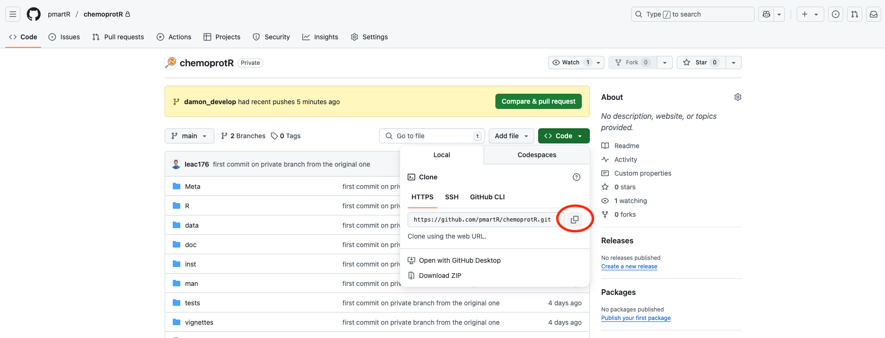

# chemoprotR

## Description
`chemoprotR` is an R package with capabilities for analyzing and creating reports for both labeled and label-free mass-spectrometry based proteomics data. Here, we discuss the workflow for tandem mass tagged (TMT) labeled data. However, label-free data follows a similar procedure. There are three main elements in the `chemoprotR` package:

1. Front End Script
2. Back End Code
3. Automatically Generated Report

In order to generate the analysis report, the user only needs to update the front end script based on the specific contexts of the data.

## Installation
Both R and RStudio are required to use this package. R can be downloaded at either https://cran.r-project.org/bin/macosx/ (Mac) or https://cran.r-project.org/bin/windows/base/ (Windows). RStudio is available at https://posit.co/downloads/. Once R and RStudio have been installed, `chemoprotR` can be installed by running the following code in the R console.

If these packages are not already installed, they can be installed using the following code using the console in RStudio:

```{r}
install.packages("readxl")
install.packages("here")
install.packages("devtools")
install.packages("openxlsx")
```

Additionally, the package `pmartR` is required to use `chemoprotR`. To download this package, please see the `pmartR` [GitHub page](https://github.com/pmartR/pmartR) for instructions on installation as well as any potential debugging.

In order to install the package `chemoprotR`, a user can go to the [GitHub page](https://github.com/pmartR/chemoprotR) and then select the "Code" button on the top right of the web page shown in **Figure 1**.


A drop-down will appear as shown in **Figure 2** and the user will then select the option to "Copy URL to clipboard" from the HTTPS tab.



Within Terminal, the user will navigate to the folder where they desire to place the repository. Once in that folder via Terminal, the user will type "git clone " and then paste the link that was copied when the user selected the "Clone to HTTPS" option.

Once downloaded, the user can install the package into R using R Studio with the following code if using a Mac:

```{r}
devtools::install_local(~/XXXXXXXXXXXX/chemoprotR)
```

If using a Windows computer, the following code can be used to install `chemoprotR`:

```{r}
devtools::install_local(~XXXXXXXXXXXX/chemoprotR)
```

where XXXXXXXXXXXX indicates the file path where the chemoprotR folder lives.

## Creating an R Project

There are a few tasks that must be completed before a user can start updating the front end script.

First, the user must create a folder for the project. Within that folder, the user must create 4 additional folders:

- Code
- Data
- Processed_Data
- Results

Within the newly constructed R project, the user can place the following files in the "Code" folder: 

- "front_end_script_labeled.R"
- "report_labeled.Rmd"
- "analysis_ref.bib"

These files can be found at the [GitHub page](https://github.com/pmartR/chemoprotR). Select the folder "inst" and within that folder, select the folder "r_scripts" for the front_end_script_labeled.R and analysis_ref.bib and select "report_templates" for the report_labeled.Rmd.

If working with label-free data, the user would instead place "front_end_script_unlabeled.R" and "report_unlabeled.Rmd" into the Code folder instead (along with the "analysis_ref.bib" file).

The user then places the excel file of data within the "Data" folder.

Next, the user should create an R project by clicking the drop down menu that says "Project: (none)" in the top right corner of the R Studio window and selecting "New Project". **Figure 3** shows where to click to create a new project.


Next, select the option to create a project from an existing directory (**Figure 4**) and select the main folder that was created for the project.


By creating an R project, R is better equipped to find files using relative file paths, allowing for easier sharing of code between individuals. After creating this project, the user simply needs to load the project when starting up R and R Studio for future sessions. It is recommended to have a different project for different experiments.

## Excel File

Users will load an excel file with multiple sheets regarding HTP information. Most of these sheets are generated using the MAC pipeline workflow. For labeled data, those sheets range from information regarding alias information, package analysis jobs, reporter ions information, mage information to protein collection data.

In addition to those sheets generated via the MAC pipeline workflow, users will need to manually add an additional sheet of sample information, often referred to as "f_data", including but not limited to information such as the sample name, grouping, replicate, and ionization. **Figure 5** shows an example of what an f_data sheet could look like for a labeled dataset.


It is important to note that the "Ionization" column in the f_data must match the columns of the "Mage" spreadsheet pertaining to the abundance values exactly. For example, if the Mage column is listed as "Ion_126.128", the value "126.128" in the f_data will lead to an error. Additionally, the sample names ("SampleID" in the example) must be unique.

To view an example an excel spreadsheet of both labeled and unlabeled data, please refer to the example files provided on the [GitHub page](https://github.com/pmartR/chemoprotR) page for the `chemoprotR` package.

## Front End Script

This next portion of the vignette explains the different aspects of the front end script, which is the only file that the user will need to alter.

##### Step 1: Set up File

For this pipeline, we load the following packages:

```{r}
library(readxl)
library(chemoprotR)
library(here)
```

The following line of code allows R to locate other files within the R Project and directory. If you change the name of the .R script, you will need to update this line of code to match the filename.

```{r}
here::i_am("Code/front_end_script_labeled.R")
```

##### Step 2: Specify Parameters

Within the labeled HTP framework, there are typically multiple sheets in the excel file. Of those sheets, the following five are needed for statistical analyses:

1. Mage
2. T Reporter Ions Typed
3. T Data Package Analysis Jobs
4. Protein Collection Information
5. f_data

Within each of these different sheets, there are varying column names that must be specified. If these values remain consistent between different analyses, these default values can remain in place. However, if they vary from experiment to experiment, they will need to be updated accordingly.

For `chemoprotR` functions to run, the user specifies the name of the excel file, the MSGF threshold value to be used for filtering, the names of the different tabs in the spreadsheet, a select number of column names from a variety of those tabs, as well as some normalization information.

First, the user specifies the name of the Excel file that contains the data and stores that as a variable `mydata`.

```{r}
mydata = "60473_Practice_Labeled.xlsx"
```

Next, the user specifies the MSGF Threshold value to be used for filtering along with the names of columns associated with different metrics from each of the different tabs in the excel file.

Additionally, the user specifies the methods for normalization.

The reference name pertains to isobaric normalization at the beginning of the procedure. This value is the name in the sample data pertaining to the reference samples. There are some scenarios where isobaric normalization is not necessary (such as only one plex). If this is the case, users can select the value "run_isobaric" to be labeled as "No". Otherwise, it recommended to keep this argument as "Yes".
The other values pertain to standard normalization prior to rolling up the peptide-level data to the protein-level. Users can choose for the the data to be either mean or median centered and if they would like to backtransform the data after undergoing normalization. The backtransform simply adde back a constant value to the entire dataset, so that all of the log-transformed abundance values are non-negative.

Users then select the method for protein rollup. This package allows for users to choose from "rollup", "rrollup", or "summation". If using "rollup" or "rrollup", users must also supply the centering method (either "mean" or "median"). Otherwise, for "summation", this is left as "none".

Finally, the user also specifies if there are any outliers to remove. The recommended process is to run the report leaving the parameter `outlier_samples` empty and see what samples are identified as potential outliers. If there are any to remove, the user can simply add a character string of the outlier sample name(s) and rerun the report leaving everything else the same. We do recommend using caution, however, when removing outliers. It is best to consult a statistician if there are any questions pertaining to outlier removal.

```{r}
msgf = 6.76378E-9

tab_names <- data.frame(analysis_jobs = "T_Data_Package_Analysis_Jobs",
                          reporter_ions = "T_Reporter_Ions_Typed",
                          mage = "Mage",
                          protein_collection = "Protein_Collection",
                          fdata = "f_data")

mage_cols <- data.frame(job_name = "Job",
                        scan_name = "Scan",
                        peptide_name = "Peptide",
                        protein_name = "Protein",
                        qvalue_name = "QValue",
                        msgf_specprob_name = "MSGF_SpecProb")

analysis_cols <- data.frame(job_name = "Job",
                            dataset_id_name = "Dataset_ID")

reporter_cols <- data.frame(dataset_id_name = "Dataset",
                            scan_name = "ScanNumber")

fdata_cols <- data.frame(sampleID_name = "SampleID",
                    group_name = "Grouping",
                    job_name = "Job",
                    replicate_name = "Replicate",
                    plex_name = "Plex",
                    ionization_name = "Ionization")

protein_collection_cols <- data.frame(proteinName_name = "protein_name")

normalization_info <- data.frame(reference_name = "Reference",
                                 norm_fn = "mean",
                                 backtransform = TRUE)
run_isobaric <- "Yes"

rollup_info <- data.frame(rollup_method = "summation",
                          centering_fn = "none")
                                 
outlier_samples <- c()
```

For unlabeled data, users should also specify protein collection information for the following columns:

- proteinCollectionID_name
- proteinCollection_name
- description_name
- referenceID_name
- residueCount_name
- monotopicMass_name
- proteinID_name

##### Step 3: Load in Data

Once those values have been adjusted accordingly based on the experiment, the rest of the code should not have to be altered. In this code chunk, the user loads the data into R as a list and renames the elements of the list to be the tab names from Excel.

```{r}
sheet_names <- excel_sheets(here("Data",mydata))
# this creates a list with each element being a sheet by its corresponding name
dat_list <- lapply(sheet_names, function(x) {          # Read all sheets to list
  as.data.frame(read_excel(here("Data",mydata),sheet = x))})
names(dat_list) <- sheet_names
# remove the xlsx portion of file name to help with naming of future files
data_name <- stringr::str_remove(mydata,".xlsx")
```

##### Step 4: Clean the Data

Similar to Step 3, the user should not have to adjust any lines of code within Step 4. Within this code chunk, the data are cleaned to create an object that is compatible with the R package `pmartR`. The package `pmartR` has many built in capabilities from quality control filtering and normalization to data visualizations and statistical analyses. The following code manipulates the data to the format required by `pmartR` so that `chemoprotR` can leverage `pmartR`'s capabilities. The cleaned data are then saved.

```{r}
htp_pmart_cleaned <- clean_chemoprot_labeled(dat_list,tab_names,mage_cols,analysis_cols,
                                             reporter_cols,fdata_cols,protein_collection_cols)
labeled_information <- list(pmartObj = htp_pmart_cleaned,msgf = msgf,fdata_info = fdata_cols,
                            analysis_info = analysis_cols,mage_info = mage_cols,norm_info = normalization_info,
                            protein_info = protein_collection_cols,data_name = mydata,
                            rollup_info = rollup_info, outlier_info = outlier_samples,
                            run_isobaric = run_isobaric)
saveRDS(labeled_information,here("Data","labeled_information.RDS"))
```

##### Step 5: Render Report

The last step is to render, or generate, the report. Labeled data are analyzed based on job number, with separate reports generated for each job.

```{r}
num_jobs = length(htp_pmart_cleaned)
job_names = names(htp_pmart_cleaned)

for(i in 1:num_jobs){
  rmarkdown::render(input = here("Code","report_labeled.Rmd"),
                    output_file = paste0("report_labeled_",data_name,"_",job_names[i],".html"))
}
```

## Report

The reports are generated automatically via the code above; the user does not need to alter the Rmarkdown file ("report_labeled.Rmd" for labeled data and "report.Rmd" for label-free data). The user simply needs to place the labeled (or label-free) report templates into the Code folder within the Project. The report is broken down into the following sections:

- Software Used
- Isobaric Normalization
  - The data are normalized to the corresponding reference pool
- Potential Outliers
  - Potential outliers are identified and plotted. If the user specifies any outliers to be removed in the front-end script, those samples are removed here
- Filters
  - Number of missing values per sample are plotted
  - Remove molecules with MSGF spectral probability greater than the specified value
  - Sum up peptide redundancies
- Normalization
  - Data are normalized using either median or mean centering. The user can specify whether the data should be backtransformed after undergoing normalization or not.
- Protein Quantitation
  - Rollup method
- Reverse Hits/Contaminants
  - Proteins associated with reverse hits or contaminants are removed from the data.
- Statistical Results
  - ANOVA and g-test analyses are conducted on the data
  - Bar plots and volcano plots to visualize the results
  - Table containing fold change information, count data, and significance levels for each molecule is created
  - Table containing the log2 normalized abundance values are also generated
- References

For label-free data, there is no section for "Isobaric Normalization" as there is no reference sample against which the experimental samples should be normalized. 

##  Contact

If there are any questions, please feel free to reach out to either Damon Leach (damon.leach@pnnl.gov) or Kelly Stratton (kelly.stratton@pnnl.gov).
